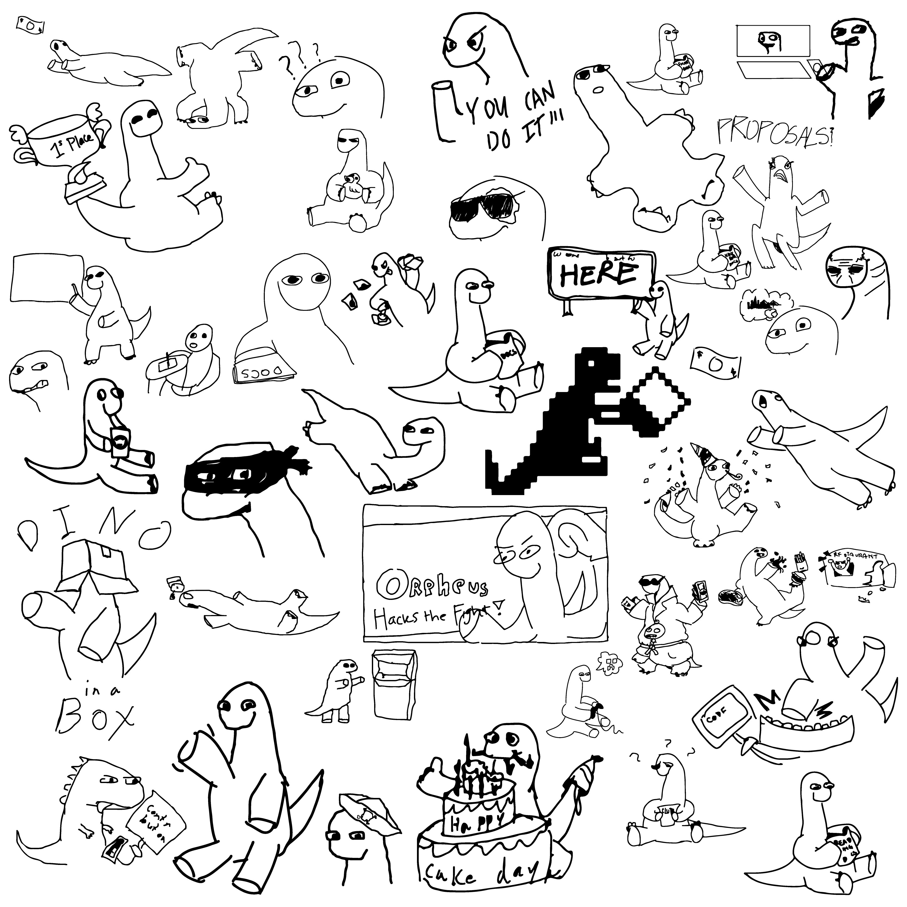
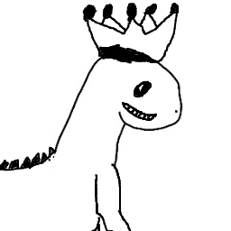
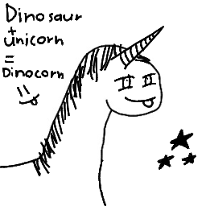

# Hack Club dinosaurs

Prophet Orpheus is Hack Club's mascot who takes the form of a nondescript dinosaur. Prophet Orpheus is always getting into crazy adventures, from stealing food to going to the moon. She is usually drawn in black and white in limited drawing programs like MS Paint or Pinta.

[Draw your own dino >>](https://hack.af/make-dino)

[Read the story of Orpheus >>](https://hackclub.com/workshops/orpheus)

_Created by http://nathanielthealligator.tumblr.com/_

---

**Prophet Orpheus**

_The Dinosaur Who Can Never Look Back_

    or else that means acknowledging [her] past and accepting the fate of the dinosaurs
    right now, [she] is still able to exist through the engagement of modern constructions
    like reading books and chasing after money
    only ever living in the present
    engaging with the idea that [she's] still alive
    Much like [her] Greek namesake, who couldn't give up on the idea that his wife is dead
    until he is finally forced to "look back"

-- <cite>nathanielthealligator</cite>

---

### Recent Dinos:

"daniel-odulate22_King_dino"

"AngelCMHxD_dinocorn"

