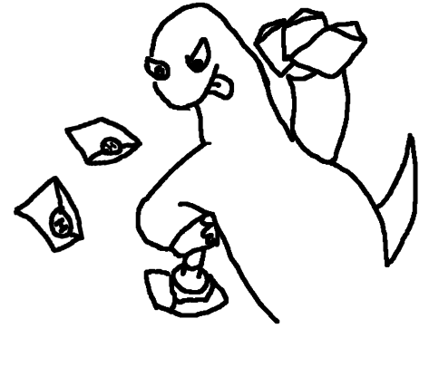
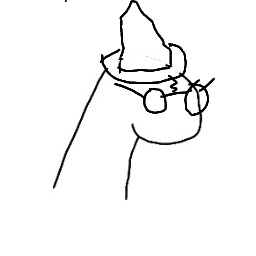

# dinosaurs

Prophet Orpheus is Hack Club's mascot who takes the form of a nondescript dinosaur. Prophet Orpheus is always getting into crazy adventures, from stealing food to going to the moon. She is usually drawn in black and white in limited drawing programs like MS Paint or Pinta.

[Read the story of Orpheus >>](https://hackclub.com/workshops/orpheus)

_Created by http://nathanielthealligator.tumblr.com/_

---

**Prophet Orpheus**

_The Dinosaur Who Can Never Look Back_

    or else that means acknowledging [her] past and accepting the fate of the dinosaurs
    right now, [she] is still able to exist through the engagement of modern constructions
    like reading books and chasing after money
    only ever living in the present
    engaging with the idea that [she's] still alive
    Much like [her] Greek namesake, who couldn't give up on the idea that his wife is dead
    until he is finally forced to "look back"

-- <cite>nathanielthealligator</cite>

---

"club dinosaur"

"a smart dinosaur reading docs"

"a dinosaur motivating someone"

"a dinosaur trying, but failing to get money"

"a dinosaur stealing food from a restaurant"

"dinosaur doing code stuff"

"dino teaching"

"dino handing docs"

"cake dino"

"birthday dino"

"party orpheus"

"dino winning"

"two dinosaurs stacked underneath a trench coat pretending to be a classic
human. top dinosaur is prophet orpheus about to hit up the club"

"dinosaur trying to contribute to open source but can't because its arms are too
short"

"confused dino"

"dinosaur coming from the future to destroy humanity"

"dino sealing letters"

"dino waving hello"

"dinosaur starting a dino-as-a-service start-up"

"i have failed"

"you promised me answers duck"

"dinosaur dressing up as a teenage mutant ninja turtle"

"dinosaur sweating bullets"

"8-bit"

"handstand"

"dinosaur trying to draw a dinosaur"

"Old Dino"

"reddit dino"

"at the arcade"

"leaping dino"

"dino drawing a dino

"confuzzled dino"

"nervous dino"

"pirate-dino"

"oopheus"

"andrewgcodes-bunnydino"

"harry dino"

"pokerface dino"

"iamcpdev-mama-orpheus-and-smol-orpheus"

"dinosaur coding on an ipad"

"polytroper-chick-hat-dino"

"polytroper-bug"

"rib44-Yo-Dyno"

"techiee619-dino"

"Dinoser on Fire"

"Sumukhy-dino"

"somyasriv16-dino_attention"

"harshraj21-harshrajdino"

"ironman9945-DINO"

"F1-P1-FURRY-HACKCLUBNMIT"

"DarkSchokolade-wildwestdino"

"pirate dino sailing through the web"

